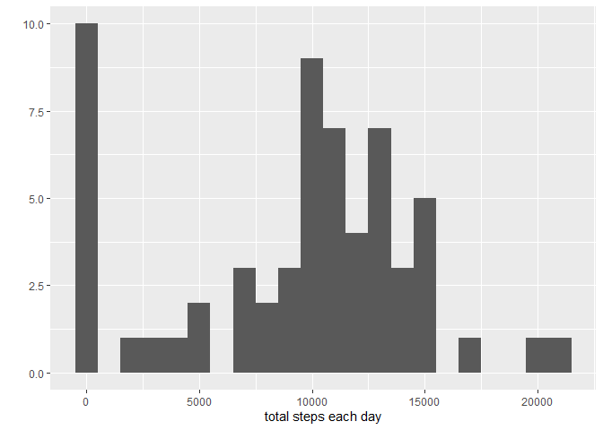
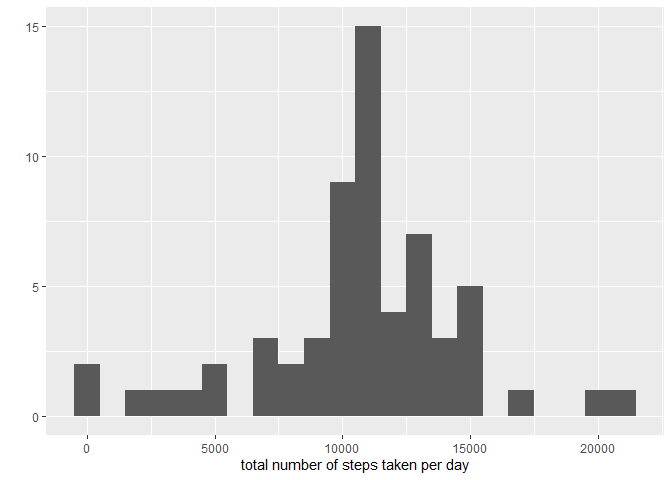
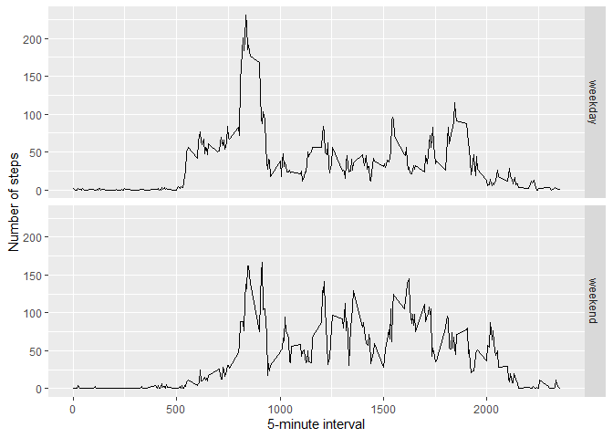

## Loading and preprocessing the data

```r
unzip(zipfile = "activity.zip")
data <- read.csv("activity.csv")
```

## What is mean total number of steps taken per day?

```r
library(ggplot2)
total.steps <- tapply(data$steps, data$date, FUN = sum, na.rm = TRUE)
qplot(total.steps, binwidth = 1000, xlab = ("total steps each day"))
```

<!-- -->

```r
mean(total.steps, na.rm = TRUE)
```

```
## [1] 9354.23
```

```r
median(total.steps, na.rm = TRUE)
```

```
## [1] 10395
```


## What is the average daily activity pattern?

```r
library(ggplot2)
averages <- aggregate(x=list(steps=data$steps), by=list(interval=data$interval), 
                      FUN=mean, na.rm=TRUE)
ggplot(data=averages, aes(x=interval, y=steps)) +
  geom_line() +
  xlab("5-minute interval") +
  ylab("average number of steps taken")
```

<!-- -->

On average across all the days in the dataset, which of the 5-minute interval contains the maximum number of steps recorded?

```r
averages[which.max(averages$steps),]
```

```
##     interval    steps
## 104      835 206.1698
```


## Imputing missing values
The data contains many days/intervals where they are missing values(which are represented by 'NA'). The presence of missing data may interfere with calculations and even summaries of the data.


```r
missing <- is.na(data$steps)
#How many are missing
table(missing)
```

```
## missing
## FALSE  TRUE 
## 15264  2304
```

all of the missing values are filled in with mean value for that 5-minute interval


```r
#Replacing each missing value with the mean value of that 5-minute interval
fill.value <- function(steps, interval) {
  filled <- NA
  if(!is.na(steps))
    filled <- c(steps)
  else
    filled <- (averages[averages$interval == interval, "steps"])
  return(filled)
}

filled.data <- data
filled.data$steps <- mapply(fill.value, filled.data$steps, filled.data$interval)
```
Now using the filled data set, I'll make a histogram of the total number of steps taken each day and calculate the mean and median of total number of steps.


```r
total.steps <- tapply(filled.data$steps, filled.data$date, FUN = sum)
qplot(total.steps, binwidth = 1000, xlab = "total number of steps taken per day")
```

<!-- -->

```r
mean(total.steps)
```

```
## [1] 10766.19
```

```r
median(total.steps)
```

```
## [1] 10766.19
```
The mean and median values are higher after inputing the missing data. The missing data 'NA' in the 'steps' values are automatically taken a 0s.However after inserting the missing values withe the mean 'steps' of corresponding 'intervals' the 0 values are removed from the histogram.


## Are there differences in activity patterns between weekdays and weekends?

First start by finding the measurements for each day of the week in the dataset. And we use the data set filled in values to take care of the NAs


```r
weekday.or.weekend <- function(date) {
  day <- weekdays(date)
  if (day %in% c("Monday", "Tuesday", "Wednesday", "Thursday", "Friday"))
    return("weekday")
  else if (day %in% c("Saturday", "Sunday"))
    return("weekend")
  else
    stop("invalid date")
  
}
filled.data$date <- as.Date(filled.data$date)
filled.data$day <- sapply(filled.data$date, FUN = weekday.or.weekend)
```

Now to create a panel plot containing plots of average number of steps taken on weekdays and weekends.


```r
averages <- aggregate(steps ~ interval + day, data = filled.data, mean)
ggplot(averages, aes(interval, steps)) + geom_line() + facet_grid(day ~ .) + 
  xlab("5-minute interval") + ylab("Number of steps")
```

<!-- -->
